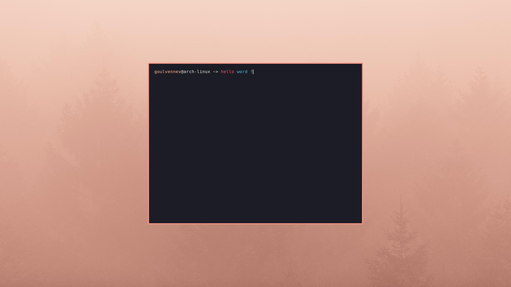

# DOTFILES

Ma configuration, basée sur Arch Linux et i3-gaps. Ce répo est destiné à mon utilisation personnelle, mais n'hésitez pas à vous en inspirer !

Raccourcis :
* Lancer un logiciel : `Super + espace`
* Lancer un terminal : `Super + entrée`
* Nagiguer dans les fichiers : `Super + Maj + entrée`
* Fermer un logiciel : `Super + c` ou `Alt + F4`
* Fermer la session : `Super + q`

Tous les autres raccourcis sont dans `Config/i3/config`

## Configuration

- Distribution: **Arch Linux**
- WM: **i3-gaps**
- Terminal: **Alacritty**
- Shell: **Fish** (et Bash)
- Thème: **Custom** (Inspiré par le theme VS Code "Horizon")
- Editeur: **VS Code**
- Lanceur: **Rofi**
- Gestionnaire de fichier: **NNN**

## Preview

## Instalation

(Work in progress)

## Fond d'écran

*par Cetteup*
